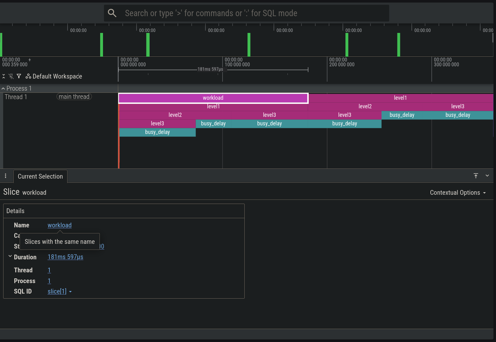

# Small C profiler

This is a small C profiler that I wrote to learn how to write a profiler.

It is not very good, but it is a good starting point for writing a profiler.


## How to build

```
make
```

## How to run

```
make run
```

# SHOW CASE 



